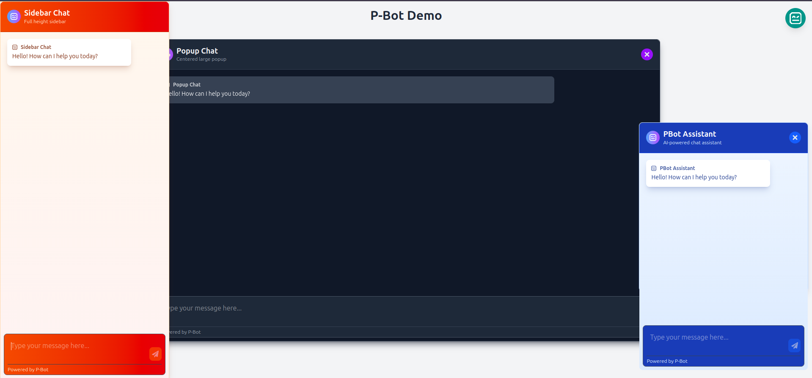

# p-gpt

A modern, customizable React chatbot component with beautiful UI themes and OpenAI integration. Add an AI-powered chat assistant to your app in minutes!



## ✨ Quick Start

### Installation

Install the package using pnpm (recommended)
```bash
pnpm add p-gpt
```

or with npm
```bash
npm install p-gpt
```

or with yarn
```bash
yarn add p-gpt
```

### Basic Usage

#### With Direct API Key

```jsx
import { PGPT } from 'p-gpt';
import 'p-gpt/dist/index.css'; // Import styles

function App() {
  return (
    <div className="App">
      <h1>My Website</h1>
      
      {/* Add the chatbot with direct OpenAI API key */}
      <PGPT 
        apiKey="your-openai-api-key" 
        model="gpt-4" // or gpt-3.5-turbo, etc.
      />
    </div>
  );
}
```

#### With Custom REST API Endpoint

```jsx
import { PGPT } from 'p-gpt';
import 'p-gpt/dist/index.css'; // Import styles

function App() {
  return (
    <div className="App">
      <h1>My Website</h1>
      
      {/* Add the chatbot with your custom backend API endpoint */}
      <PGPT 
        routerConfig={{
          route: "https://your-backend-api.com/chat",
          model: "custom-model", // Optional
          tokens: 2000 // Optional max tokens
        }}
        title="Chat Assistant"
      />
    </div>
  );
}
```

## 🌟 Key Features

- **Beautiful UI Themes** - 10+ pre-designed themes (dark, light, blue, purple, etc.)
- **Multiple Layouts** - Choose between popup, sidebar, or normal chat window
- **Smart AI Responses** - Direct integration with OpenAI's models or your custom backend
- **Flexible Integration** - Use direct API keys or your custom backend REST API
- **Custom Positioning** - Place the chat button with standard positions or exact coordinates
- **Typing Effect** - Optional realistic typing animation for responses
- **Customizable** - Easily modify appearance, position, and behavior
- **Conversation Persistence** - Auto-saves chats in browser storage
- **Mobile Responsive** - Works great on all device sizes

## 🔧 Configuration

### Essential Props

| Prop | Type | Description |
|------|------|-------------|
| `apiKey` | string | Your OpenAI API key (required if not using `routerConfig`) |
| `routerConfig` | object | Router configuration for custom API endpoint (required if not using `apiKey`) |
| `model` | string | OpenAI model to use (only needed with `apiKey`) |
| `theme` | string | UI theme (default: "blue") |
| `position` | string or object | Button position (default: "bottom-right") |
| `title` | string | Chat title (default: "PGPT Assistant") |
| `defaultOpen` | boolean | Whether the chat window opens automatically (default: false) |

### Example with Direct API Key

```jsx
<PGPT 
  apiKey="your-openai-api-key" 
  model="gpt-4"
  title="Customer Support"
  subtitle="How can we help?"
  theme="dark"
  position="bottom-right"
  enableTypingAnimation={true}
/>
```

### Example with Custom REST API

```jsx
<PGPT 
  routerConfig={{
    route: "https://your-backend-api.com/chat",
    model: "gpt-4",
    tokens: 2000,
    schema: {
      // Optional custom payload structure
      customField: "value"
    }
  }}
  title="Customer Support"
  subtitle="How can we help?"
  theme="green"
  position="bottom-right"
  enableTypingAnimation={true}
/>
```

## 🎨 Themes

Choose from these beautiful themes:

- `light` - Clean, light theme with blue accents
- `dark` - Dark theme with purple accents
- `blue`, `purple`, `green`, `amber`, `teal`, `indigo`, `red`, `pink`, `midnight`, `sunset`

```jsx
<PGPT theme="purple" />
```

## 🔌 Integration Options

### Direct LLM Integration

Use this option to directly integrate with OpenAI's API using your own API key:

```jsx
<PGPT 
  apiKey="your-openai-api-key"
  model="gpt-4o" // or any other supported model
  llmProvider="OpenAI"
/>
```

### Custom Backend Integration

Use this option to route requests through your own backend service with advanced configuration:

```jsx
<PGPT 
  routerConfig={{
    route: "https://your-api.com/chat",
    model: "custom-model", // Optional - model to use
    tokens: 2000, // Optional - max tokens to generate
    schema: {
      // Optional - custom payload schema
      customField: "value",
      otherSettings: true
    }
  }}
/>
```

Your backend will receive messages in this format (or your custom schema):
```json
{
  "messages": [
    {"role": "system", "content": "You are a helpful assistant..."},
    {"role": "user", "content": "Hello, how are you?"}
  ],
  "model": "custom-model",
  "temperature": 0.7,
  "max_tokens": 2000,
  "customField": "value",
  "otherSettings": true
}
```

Your backend should respond with:
```json
{
  "role": "bot",
  "content": "I'm doing well, thank you for asking! How can I assist you today?"
}
```

## 📍 Positioning Options

### Standard Corner Positions

Use one of four predefined corner positions:

```jsx
<PGPT position="bottom-right" /> // Default
<PGPT position="bottom-left" />
<PGPT position="top-right" />
<PGPT position="top-left" />
```

### Special Positions

Additional predefined positions for more flexible layouts:

```jsx
// Centered in the middle of the screen
<PGPT position="center" />

// Fixed at the top, horizontally centered
<PGPT position="fixed" />

// Full-height sidebar on the left
<PGPT position="left-full-height" />

// Full-height sidebar on the right
<PGPT position="right-full-height" />

// Full-width bar at the top
<PGPT position="top-full-width" />

// Full-width bar at the bottom
<PGPT position="bottom-full-width" />

// Fullscreen mode (covers entire viewport)
<PGPT position="fullscreen" />
```

### Custom Coordinates

For precise positioning, provide x and y coordinates with optional offsets:

```jsx
// Basic positioning with exact coordinates
<PGPT position={{ x: "20px", y: "50px" }} />

// Using relative units
<PGPT position={{ x: "5vw", y: "calc(100vh - 100px)" }} />

// With numeric values (converted to pixels)
<PGPT position={{ x: 20, y: 50 }} />

// With offsets for chat window positioning
<PGPT 
  position={{ 
    x: "50vw",               // Button X position
    y: "50vh",               // Button Y position
    offsetX: "-200px",       // Chat window X offset from button
    offsetY: "100px"         // Chat window Y offset from button
  }} 
/>
```

### Position Behavior Logic

- **Corner Positions**: When in a corner, the chat window opens with a slight offset from the button
- **Full-height/width**: These layouts stretch the chat window to fill the entire height or width
- **Fullscreen**: Takes over the entire viewport, ideal for mobile or focus mode
- **Custom**: Allows complete control over both button and chat window positioning

### Auto-Open Chat

To have the chat window open automatically when the page loads:

```jsx
<PGPT 
  defaultOpen={true}
  chatLayout="popup" // Works best with popup layout
/>
```

## 💼 Customer Support Integration

Create a dedicated customer support chatbot with just a few lines of code:

```jsx
<PGPT 
  apiKey="your-openai-api-key"
  title="Customer Support"
  subtitle="We're here to help!"
  theme="blue"
  systemMessage="You are a helpful customer support agent for our company. Help users with their questions about our products and services. Be friendly, professional, and concise."
  welcomeMessage="Hello! I'm your customer support assistant. How can I help you today?"
  rules={[
    "Always be polite and professional",
    "If you don't know the answer, suggest contacting our support team at support@example.com",
    "Offer clear step-by-step instructions when providing solutions"
  ]}
/>
```

For different support departments:

```jsx
// Technical Support
<PGPT 
  role="coder"  // Technical mindset
  title="Tech Support" 
  systemMessage="You are a technical support specialist. Help users solve technical problems with our software."
/>

// Billing Support
<PGPT 
  title="Billing Support"
  systemMessage="You are a billing support specialist. Help users with questions about their account, subscriptions, and payments."
/>

// Product Support
<PGPT 
  title="Product Help" 
  systemMessage="You are a product specialist. Help users understand how to use our product features effectively."
/>
```

## 📋 Layout Options

| Layout | Description |
|--------|-------------|
| `normal` | Standard chat window (default) |
| `popup` | Large, centered popup |
| `sidebar` | Full-height sidebar |

```jsx
<PGPT chatLayout="sidebar" />
```

## 💬 Assistant Roles

Set up specialized assistants with predefined personalities:

```jsx
<PGPT role="coder" />  // Programming assistant
<PGPT role="customer_support" /> // Customer Support assistant 
<PGPT role="teacher" /> // Educational assistant
```

Available roles: `assistant`, `coder`, `writer`, `teacher`, `researcher`, `translator`, `customer_support`

## 🎭 Custom Styling

Apply your own styles to match your brand:

```jsx
const customStyles = {
  chatContainer: { borderRadius: '16px' },
  header: { background: 'linear-gradient(90deg, #4a6cf7, #4a2cf7)' },
  userBubble: { borderRadius: '18px' },
  botBubble: { borderRadius: '18px' }
};

<PGPT customStyles={customStyles} />
```

## 📱 Responsive Options

Control size and position:

```jsx
<PGPT 
  position="bottom-right" // or "bottom-left", "top-right", "top-left"
  buttonSize="medium"     // or "small", "large"
  fixedHeight="400px"     // for normal layout
/>
```

## 👨‍👩‍👧‍👦 Browser Support

Compatible with all modern browsers:
- Chrome, Firefox, Safari, Edge (latest versions)

## 🛠️ Complete Props Reference

| Prop | Type | Default | Description |
|------|------|---------|-------------|
| `apiKey` | string | - | OpenAI API key (required if not using `routerConfig`) |
| `routerConfig` | object | - | Router configuration for custom API endpoint (required if not using `apiKey`) |
| `llmProvider` | string | "openai" | LLM provider (only used with `apiKey`) |
| `model` | string | (first available) | OpenAI model name (only used with `apiKey`) |
| `placeholder` | string | "Type your message here..." | Input placeholder text |
| `title` | string | "PGPT Assistant" | Title displayed in header |
| `subtitle` | string | "AI-powered chat assistant" | Subtitle displayed in header |
| `theme` | string | "blue" | UI theme |
| `position` | string or object | "bottom-right" | Position of chat button and window. Options: 'top-left', 'top-right', 'bottom-left', 'bottom-right', 'center', 'fixed', 'left-full-height', 'right-full-height', 'top-full-width', 'bottom-full-width', 'fullscreen', or a custom object `{x, y, offsetX?, offsetY?}` |
| `welcomeMessage` | string | "Hello! How can I help you today?" | Initial message from bot |
| `buttonSize` | string | "medium" | Size of chat button |
| `initiallyOpen` | boolean | false | Whether chat is initially open |
| `role` | string | "assistant" | Role template for the bot |
| `rules` | string[] | [] | Rules to guide AI responses |
| `customLogo` | React.ReactNode | - | Custom icon for button/header |
| `chatLayout` | string | "normal" | Layout style |
| `minHeight` | string | "28rem" | Minimum height of chat window |
| `maxHeight` | string | "80vh" | Maximum height of chat window |
| `systemMessage` | string | - | Custom system message for AI |
| `customStyles` | object | {} | Custom styles for elements |
| `showLabelWithLogo` | boolean | false | Show title with logo in button |
| `fixedHeight` | string | "400px" | Fixed height for normal layout |
| `errorColor` | string | "#ef4444" | Color of error notifications |
| `warningColor` | string | "#f59e0b" | Color of warning notifications |
| `isCloseable` | boolean | true | Whether chat can be closed |
| `enableTypingAnimation` | boolean | false | Enable typing animation |
| `defaultOpen` | boolean | false | Open chat window automatically on load |

## 🔗 Links

- [GitHub Repository](https://github.com/code-abdulrehman/p-gpt)
- [Issue Tracker](https://github.com/code-abdulrehman/p-gpt/issues)
- [NPM Package](https://www.npmjs.com/package/p-gpt)

## 👨‍💻 Author

P-GPT is created and maintained by Abdul Rehman.

## 🤝 Contributing

Contributions are welcome! Please feel free to submit a Pull Request.

## 📄 License

MIT