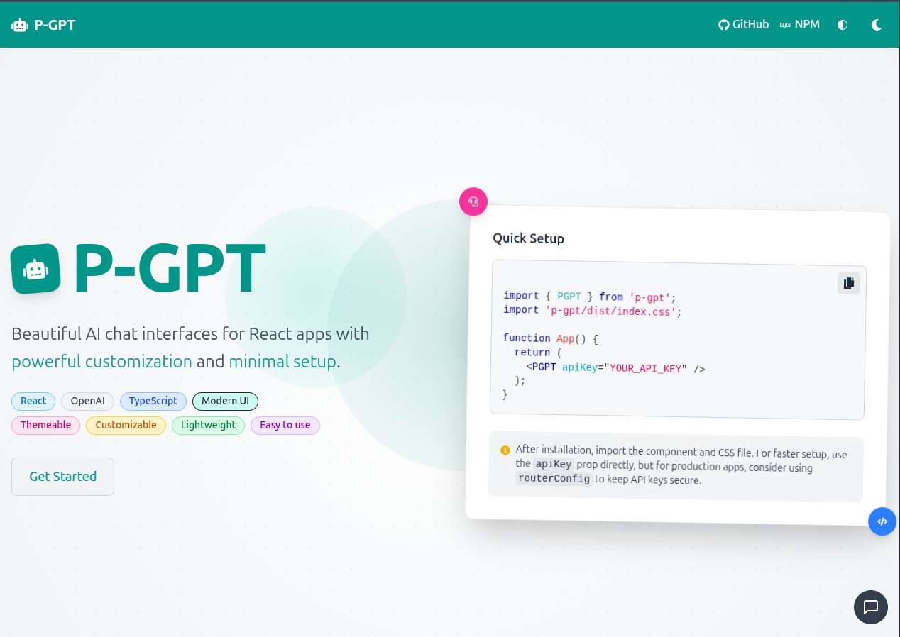

# P-GPT: React AI Chat Assistant

A modern, customizable React chat component with beautiful themes, smart positioning, and seamless AI integration. Add an AI-powered chat assistant to your React app in minutes!



## 🚀 Features

- **Beautiful UI Themes** - 6 carefully designed themes with light/dark mode support
- **Smart Positioning** - 3 optimized positions: bottom-left, bottom-right, and fullscreen
- **AI Integration** - Works with OpenAI, Google Gemini, and custom APIs
- **Context Management** - Optional chat history inclusion with token optimization
- **Highly Customizable** - Appearance, behavior, and styling options
- **Dark Mode Support** - All themes include dark mode variants
- **Conversation History** - Auto-saves chats with flexible storage options
- **Typing Animation** - Realistic typewriter effect for bot responses
- **Mobile Responsive** - Optimized for all device sizes

## 📦 Installation

```bash
# With npm
npm install p-gpt

# With yarn
yarn add p-gpt

# With pnpm
pnpm add p-gpt
```

## 🔧 Quick Start

### Basic Usage with OpenAI

```jsx
import { PGPT } from 'p-gpt';
import 'p-gpt/dist/assets/index-CMxICLrA.css';

function App() {
  return (
    <PGPT 
      apiKey="YOUR_API_KEY" 
      theme="chatgpt"
      appearance="dark"
    />
  );
}
```

### With Google Gemini

```jsx
import { PGPT } from 'p-gpt';
import 'p-gpt/dist/assets/index-CMxICLrA.css';

function App() {
  return (
    <PGPT 
      apiKey="YOUR_GEMINI_API_KEY" 
      llmProvider="Gemini"
      model="gemini-1.5-pro"
      theme="premium"
      appearance="light"
      content={{
        title: "AI Assistant",
        welcomeMessage: "Hello! I'm powered by Gemini. How can I assist you?"
      }}
    />
  );
}
```

### With Custom API Endpoint

```jsx
import { PGPT } from 'p-gpt';
import 'p-gpt/dist/assets/index-CMxICLrA.css';

function App() {
  return (
    <PGPT 
      routerConfig={{
        endpoint: "/api/chat",
        headers: {
          "x-api-key": "internal-api-key"
        }
      }}
      theme="titanium"
    />
  );
}
```

## 🎨 Available Themes

P-GPT includes 6 beautiful themes, each supporting both light and dark modes:

- **`chatgpt`** - OpenAI's signature green theme
- **`grok`** - X's Grok orange/red theme  
- **`silver`** - Classic silver/gray theme
- **`premium`** - Purple gradient premium theme
- **`titanium`** - Modern zinc/titanium theme
- **`claude`** - Anthropic's Claude purple theme

```jsx
<PGPT 
  theme="premium"  
  appearance="dark"  // "light" or "dark"
/>
```

## 📍 Positioning Options

Choose from 3 optimized positions:

```jsx
// Standard positions
<PGPT position="bottom-right" /> // Default
<PGPT position="bottom-left" />
<PGPT position="fullscreen" />

// Custom position with exact coordinates
<PGPT 
  position={{ 
    x: "20px",
    y: "50px",
    offsetX: "10px",  // Chat window offset
    offsetY: "10px"   // Chat window offset
  }} 
/>
```

## 🧠 AI Integration

### OpenAI Models

```jsx
<PGPT 
  apiKey="YOUR_OPENAI_API_KEY"
  model="gpt-4o" // gpt-4o, gpt-4-turbo, gpt-3.5-turbo
  llmProvider="OpenAI"
/>
```

### Google Gemini Models

```jsx
<PGPT 
  apiKey="YOUR_GEMINI_API_KEY"
  llmProvider="Gemini"
  model="gemini-1.5-pro" // gemini-1.5-pro, gemini-1.5-flash, gemini-pro, gemini-pro-vision
/>
```

### Context-Aware Conversations

By default, P-GPT only sends the latest user message to avoid rate limiting. Enable context for better conversations:

```jsx
<PGPT 
  apiKey="YOUR_API_KEY"
  theme="premium"
  includeHistory={true}
  contextLength={5}
  content={{
    title: "Context-Aware Assistant",
    welcomeMessage: "Hi! I can remember our recent conversation for better context."
  }}
/>
```

**Context Management:**
- **Default behavior:** Only sends system message + latest user prompt (reduces tokens & rate limiting)
- **With context:** Includes recent chat history for better conversation flow
- **contextLength:** Controls how many recent messages to include (default: 10)
- **Trade-off:** Better context vs. higher token usage and potential rate limits

### Custom Backend API

```jsx
<PGPT 
  routerConfig={{
    endpoint: "https://your-api.com/chat",
    headers: {
      "Authorization": "Bearer your-auth-token"
    },
    maxTokens: 2000
  }}
/>
```

Your backend should accept:
```json
{
  "messages": [
    {"role": "system", "content": "You are a helpful assistant..."},
    {"role": "user", "content": "Hello, how are you?"}
  ],
  "model": "custom-model",
  "temperature": 0.7,
  "max_tokens": 2000
}
```

And respond with:
```json
{
  "role": "bot",
  "content": "I'm doing well, thank you for asking! How can I assist you today?"
}
```

## 💅 Customization

### Content Configuration

```jsx
<PGPT 
  content={{
    title: "Customer Support",
    subtitle: "We're here to help!",
    welcomeMessage: "Hello! How can I assist you today?",
    placeholder: "Type your question here...",
    systemMessage: "You are a helpful customer support agent..."
  }}
/>
```

### Appearance & Behavior

```jsx
<PGPT 
  theme="silver"
  appearance="dark"
  buttonSize="medium" // "small", "medium", "large"
  buttonStyle="circle" // "circle", "rounded", "square", "pill"
  defaultOpen={false}
  openTrigger="click" // "click" or "hover"
  enableTypingAnimation={true}
  bubbleStyle="modern" // "default", "modern", "rounded", "sharp", "bordered", "minimal"
  loadingAnimation="typingDots" // "dots", "spinner", "pulse", "bar", "typingDots"
/>
```

### Storage Options

```jsx
<PGPT 
  storage={{
    type: "localStorage" // "localStorage", "sessionStorage", "none", "custom"
  }}
/>
```

### Advanced Features

```jsx
<PGPT 
  role="coder" // "assistant", "coder", "teacher", "customer-support", "sales"
  rules={[
    "Always be polite and professional",
    "If you don't know the answer, suggest contacting support",
    "Never share personal information"
  ]}
  colors={{
    primary: "#10a37f",
    secondary: "#1a7f64"
  }}
  onSendMessage={(message) => console.log('Sent:', message)}
  onReceiveMessage={(response) => console.log('Received:', response)}
/>
```

## 📱 Responsive Configuration

```jsx
<PGPT 
  minHeight="28rem"
  maxHeight="80vh"
  fixedHeight="400px"
  chatLayout="popup" // "normal", "popup", "sidebar"
/>
```

## 📋 Complete Props Reference

### Core Props

| Prop | Type | Default | Description |
|------|------|---------|-------------|
| `apiKey` | string | - | OpenAI/Gemini API key |
| `routerConfig` | object | - | Custom API endpoint configuration |
| `theme` | string | "silver" | UI theme (chatgpt, grok, silver, premium, titanium, claude) |
| `appearance` | string | "light" | Appearance mode: "light", "dark", or "system" |
| `model` | string | "gpt-4o" | AI model to use |
| `position` | string/object | "bottom-right" | Chat position (bottom-left, bottom-right, fullscreen, or custom object) |

### Content Props

| Prop | Type | Default | Description |
|------|------|---------|-------------|
| `content` | object | {} | Text content configuration |
| `content.title` | string | "PGPT Assistant" | Chat header title |
| `content.subtitle` | string | "AI-powered chat assistant" | Chat header subtitle |
| `content.welcomeMessage` | string | "Hello! How can I help you today?" | Initial bot message |
| `content.placeholder` | string | "Type your message here..." | Input placeholder text |
| `content.systemMessage` | string | "" | System message for AI behavior |

### Behavior Props

| Prop | Type | Default | Description |
|------|------|---------|-------------|
| `useTextarea` | boolean | true | Use textarea instead of input field |
| `enableTypingAnimation` | boolean | true | Enable typewriter effect for responses |
| `defaultOpen` | boolean | false | Open chat automatically on load |
| `openTrigger` | string | "click" | How to open chat: "click" or "hover" |
| `isCloseable` | boolean | true | Allow users to close the chat |

### Advanced Props

| Prop | Type | Default | Description |
|------|------|---------|-------------|
| `llmProvider` | string | "OpenAI" | LLM provider: "OpenAI" or "Gemini" |
| `role` | string | "assistant" | Bot role/personality |
| `rules` | string[] | [] | Custom behavior rules |
| `includeHistory` | boolean | false | Include chat history in API calls (increases token usage) |
| `contextLength` | number | 10 | Number of recent messages to include when includeHistory is true |

### Storage Props

| Prop | Type | Default | Description |
|------|------|---------|-------------|
| `storage` | object | {type: "localStorage"} | Message storage configuration |
| `storage.type` | string | "localStorage" | Storage type: "localStorage", "sessionStorage", "none", "custom" |
| `storage.key` | string | auto-generated | Custom storage key |
| `storage.getItem` | function | - | Custom storage getter function |
| `storage.setItem` | function | - | Custom storage setter function |

### Styling Props

| Prop | Type | Default | Description |
|------|------|---------|-------------|
| `colors` | object | {} | Custom color overrides |
| `classes` | object | {} | Custom CSS class overrides |
| `styles` | object | {} | Custom inline style overrides |
| `buttonSize` | string | "medium" | Button size: "small", "medium", "large" |
| `buttonStyle` | string | "circle" | Button shape: "circle", "rounded", "square", "pill" |
| `bubbleStyle` | string | "default" | Message bubble style |
| `loadingAnimation` | string | "typingDots" | Loading animation type |

### Layout Props

| Prop | Type | Default | Description |
|------|------|---------|-------------|
| `chatLayout` | string | "normal" | Layout type: "normal", "popup", "sidebar" |
| `minHeight` | string | "28rem" | Minimum chat height |
| `maxHeight` | string | "80vh" | Maximum chat height |
| `fixedHeight` | string | "400px" | Fixed chat height |

### Event Handlers

| Prop | Type | Default | Description |
|------|------|---------|-------------|
| `onSendMessage` | function | - | Callback when user sends a message |
| `onReceiveMessage` | function | - | Callback when bot responds |
| `onOpen` | function | - | Callback when chat opens |
| `onClose` | function | - | Callback when chat closes |

## 🔗 Links

- [GitHub Repository](https://github.com/code-abdulrehman/p-gpt)
- [NPM Package](https://www.npmjs.com/package/p-gpt)
- [Issue Tracker](https://github.com/code-abdulrehman/p-gpt/issues)

## 📄 License

MIT © [P-GPT Team](https://github.com/code-abdulrehman)
